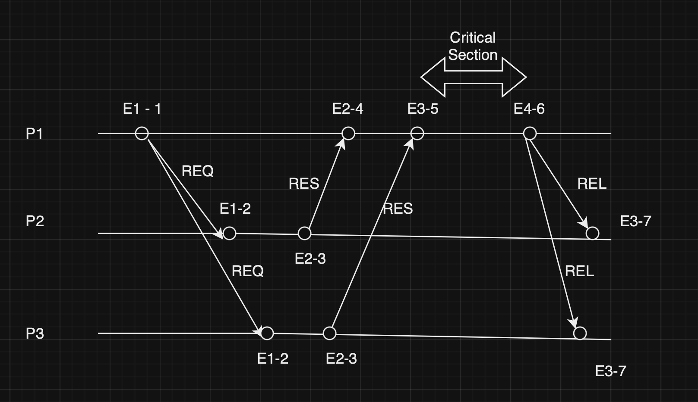
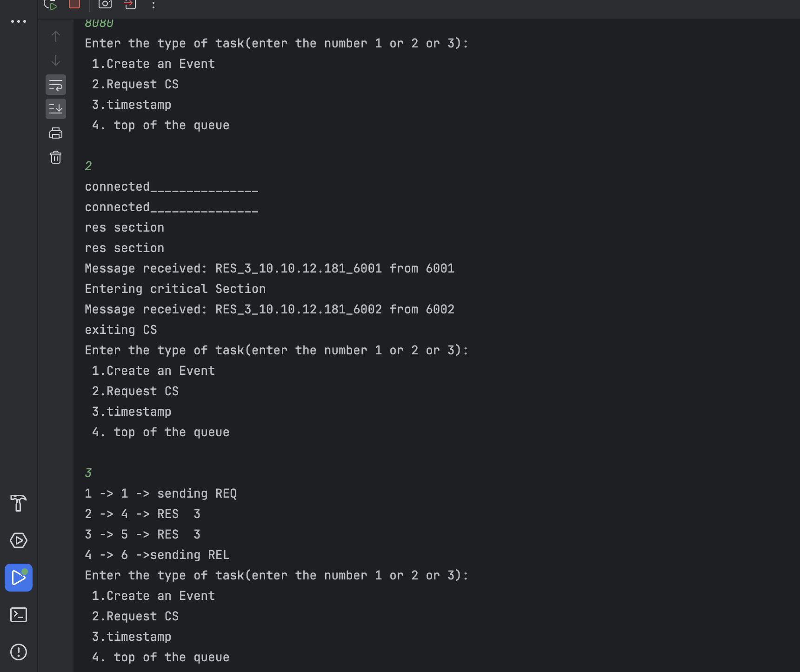
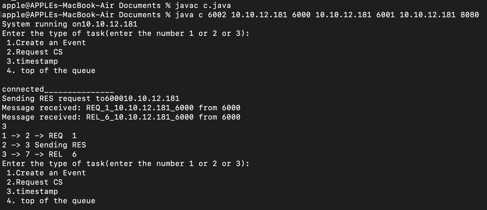
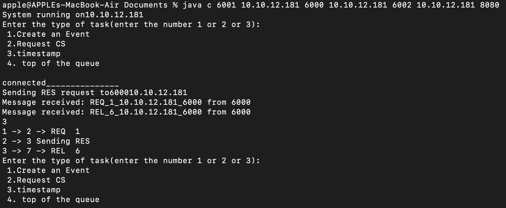
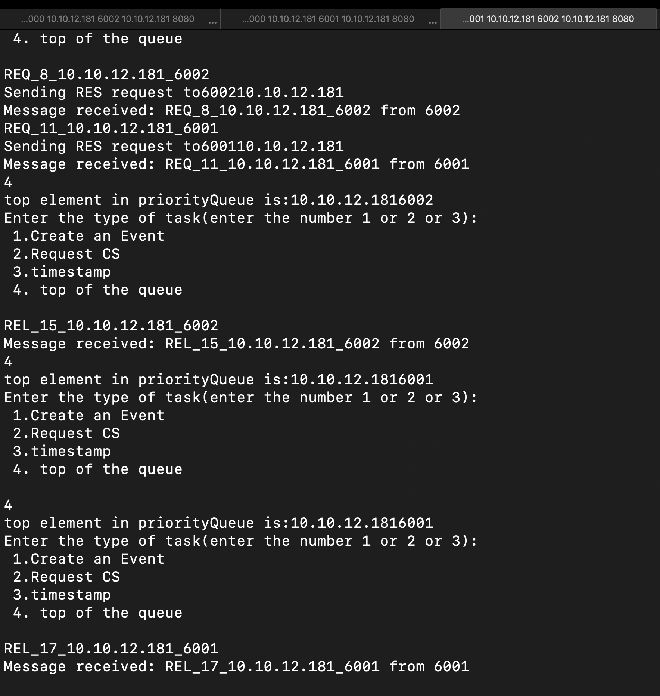

# Lamports_Mutual_Exclusion
### What we implimented
  

Code is return to work for only 3 processes but can be scaled easily if needed , Every processes can create a local event or request for Critical section.For every sending messages and recieveing messages is considered as an event and the timestamp is incremented.  Every process has a listener and a sender and every pair of nodes have two sockets connected where one socket is used for sending messages to another and other for recieving messages. Messages are of three types  
-RES for Response message  
-REQ for Request critical section message  
-REL for Release message  

Every process can create a new event or request for critical section.Critical section in this project is just used to show which process entered at which time and exited at which time ,by that we can check the mutual exclusion in just by checking the time when the next process entered it.The details are printed in critical_section.java . The programme is coded to handle one request from one process at a time which means if a process requested a critical_section then it won't take any input until the release message is given out but other process can request for the critical section .  
To check for the casuality we can print the events and timestamps in every process   
  
Here it represents (Event no) -> (local timestamp) -> (type of Event) (timestamp of the process which sent the message if any)  
As you can see from the figure Requests are sent at timestamp=1 and responses from other process are recived at senders_timestamp=3 which are greater than 1 casuality is not broken. Same can be said for the other two processes  
  
  
We can also check the request which is top of the priority queue by entering 4  
  


### Basic Syntax to start the client code is

Format of cmd  
java client (port no of listner) (ip add of client 1> <port of client 1) (ip add of client 2) (port of client 2) (ip add of Critical Section server ) (port of Critical Section server)

run this for client 1
```bash
javac client.java
java client 6000 10.10.12.181 6002 10.10.12.181 6001 10.10.12.181 8080
```
run this for client 2
```bash
javac client.java
java client 6001 10.10.12.181 6000 10.10.12.181 6002 10.10.12.181 8080
```
run this for client 3
```bash
javac client.java
java client 6002 10.10.12.181 6000 10.10.12.181 6001 10.10.12.181 8080
```
Replace the IP address with the appropriate ones while running the code  

user can Directly run the cmd
```bash
javac client.java
java client
```
IP address of the system user running will be visible 
and inputs will be asked if not provided as arguments
For running the critical section block
  ```bash
javac critical_section.java
java critical_section 8080
```
logging details are outputed in critical_section code .

## Team members
Rajesh Thiriveedhi 20CS02006  
Y Jhanvi 20CS01025  
Muppidi Shishir Reddy 20CS01001
